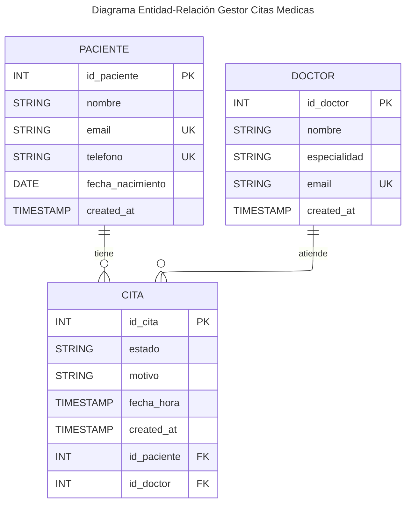

# Sistema Fullstack (Go + Vue + GraphQL + PostgreSQL)

## 1. Descripción del sistema

### Alcance del Caso Práctico (Sistema de Citas Médicas)

La solución consiste en el desarrollo de un gestor de citas médicas, permitiendo administrar pacientes, doctores y la programación de citas entre ambos.

### 1. Modelado

Se definen tres entidades principales:

- Paciente
- Doctor
- Cita

__Relaciones:__
- Un Paciente puede tener múltiples Citas
- Un Doctor puede tener múltiples Citas
- Una Cita pertenece a un único Paciente y a un único Doctor

> [!NOTE]
> Esto genera una relación muchos a muchos entre Paciente y Doctor, resuelta mediante la entidad Cita.

#### ERD (Diagrama Entidad-Relación en Mermaid)



---

### 2. Flujo Funcional (end-to-end)

Caso de uso completo:
1. Registrar paciente
2. Registrar doctor
3. Agendar cita médica
4. Consultar citas por paciente
5. Consultar citas por doctor
6. Actualizar estado de la cita (pendiente, atendida, cancelada)
7. Cancelar cita

---
Este sistema es una aplicación fullstack distribuida basada en una arquitectura desacoplada, compuesta por:

- Un **frontend** desarrollado en Vue.js con servidor Nuxt.
- Un **backend** en Golang que expone una API GraphQL.
- Una **base de datos PostgreSQL** para la persistencia.

El sistema se ejecuta mediante contenedores Docker y está desplegado en múltiples nodos, separando responsabilidades por capa.

> [!NOTE]
> La comunicación entre servicios sigue un flujo desacoplado, facilitando mantenimiento y escalabilidad.


### Flujo de comunicación

Cliente → Frontend → Backend → Base de Datos

- Cliente → Frontend: HTTP/HTTPS
- Frontend → Backend: GraphQL sobre HTTP/HTTPS
- Backend → Base de datos: SQL sobre TCP/IP

---

## 2. Tecnologías usadas

### Frontend

- Vue.js
- Node.js
- PNPM

### Backend

- Golang
- GraphQL

### Base de datos

- PostgreSQL

### Infraestructura

- Docker
- Docker Compose

> [!TIP]
> El uso de Docker permite garantizar consistencia entre entornos de desarrollo y producción.

---

## 3. Arquitectura de despliegue

| Componente      | Rol              | IP            | Puerto |
| --------------- | ---------------- | ------------- | ------ |
| Frontend Server | Servidor Nux/Vue.js  | 10.43.100.33  | 3000   |
| Backend Server  | API GraphQL (Go) | 10.43.100.131 | 8081   |
| Database Server | PostgreSQL       | 10.43.99.105  | 5432   |

> [!IMPORTANT]
> Cada componente está desacoplado y puede desplegarse en nodos distintos.

---

## 4. Configuración de la base de datos

> [!IMPORTANT]
> Se implementaron medidas de seguridad evitando el uso de configuraciones por defecto.

### Configuración aplicada

- Se creó un **usuario específico para la aplicación**.
- Se creó una **base de datos asociada a dicho usuario**.
- No se utiliza:
  + Usuario: `postgres`
  + Base de datos: `postgres`

> [!WARNING]
> El uso del usuario `postgres` en producción es una mala práctica de seguridad.

### Archivos modificados

- `postgresql.conf`
- `pg_hba.conf`

### Restricciones de acceso

> [!NOTE]
> El acceso a la base de datos está restringido únicamente al backend.

- En `pg_hba.conf`:
  + Se permitió acceso **solo desde la IP del backend (10.43.100.131)**.
  + No se permite acceso global (`0.0.0.0/0`).

> [!TIP]
> Esto reduce la superficie de ataque y evita accesos no autorizados.

---

## 5. Dockerfiles

### Backend (Golang)

> [!NOTE]
> Se utiliza un build multi-stage para reducir el tamaño final de la imagen.

```Dockerfile
# ---------- BUILD ----------
FROM docker.io/library/golang:1.25-alpine AS builder

WORKDIR /app

RUN apk add --no-cache git

COPY go.mod go.sum ./
RUN go mod download

COPY . .

RUN go build -o app .

# ---------- RUN ----------
FROM docker.io/library/alpine:latest

WORKDIR /app

COPY --from=builder /app/app .

EXPOSE 8081

CMD ["./app"]
```

---

### Frontend (Vue.js)

> [!NOTE]
> Se usa PNPM para gestión eficiente de dependencias y build optimizado.

```Dockerfile
FROM node:24-alpine
WORKDIR /app

RUN corepack enable && corepack prepare pnpm@latest --activate

COPY package.json pnpm-lock.yaml ./
RUN pnpm install --frozen-lockfile

COPY . .
RUN pnpm build

ENV NODE_ENV=production
EXPOSE 3000

CMD ["node", ".output/server/index.mjs"]
```

---

## 6. Despliegue del sistema

### Prerrequisitos

- Docker
- Docker Compose

> [!TIP]
> Verifica versiones compatibles antes de desplegar.

---

### Pasos

1. Clonar el repositorio

```bash
git clone <URL_DEL_REPOSITORIO>
cd <NOMBRE_DEL_PROYECTO>
```

2. Construir y levantar servicios

```bash
docker-compose up -d
```

> [!NOTE]
> Este comando construye las imágenes y levanta todos los contenedores definidos.

---

## 7. Servicios expuestos

| Servicio   | Puerto | Descripción    |
| ---------- | ------ | -------------- |
| Frontend   | 3000   | Aplicación web |
| Backend    | 8081   | API GraphQL    |
| PostgreSQL | 5432   | Base de datos  |

> [!WARNING]
> No exponer PostgreSQL públicamente en producción sin control de acceso.

---

## 8. Consideraciones de seguridad

> [!IMPORTANT]
> Se aplicaron buenas prácticas básicas de seguridad.

- Separación de servicios por nodos.
- Restricción de acceso a la base de datos por IP.
- Uso de usuario y base de datos personalizados.
- Evitar exposición innecesaria de puertos.

> [!TIP]
> Se recomienda usar variables de entorno para credenciales sensibles.
